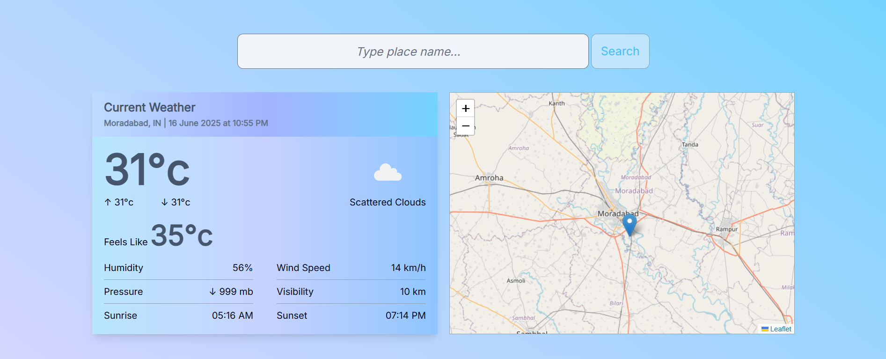
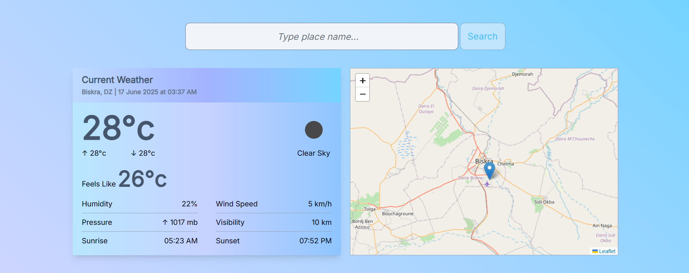
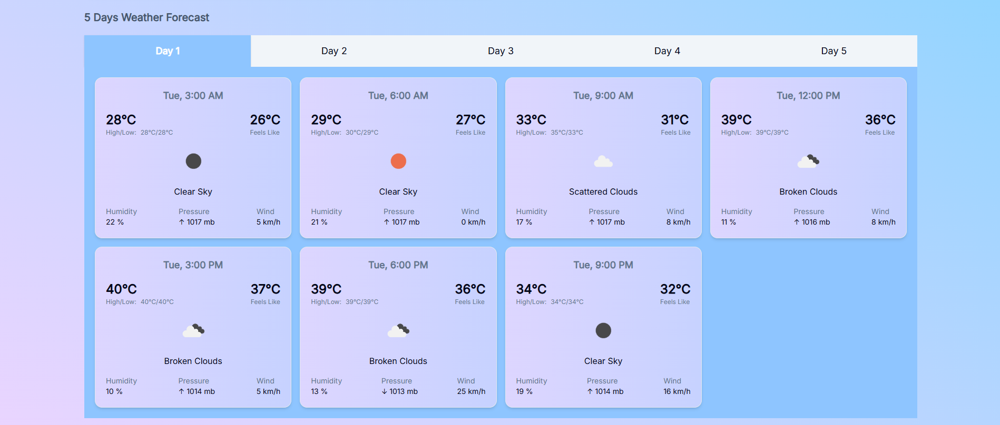
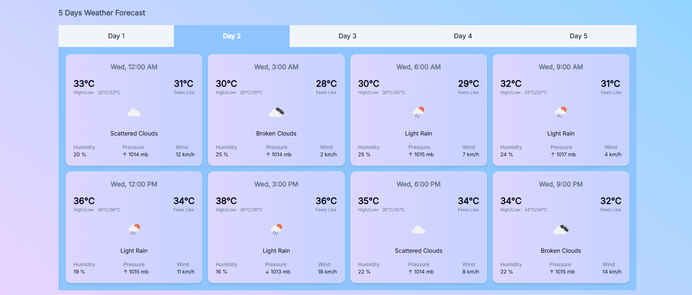
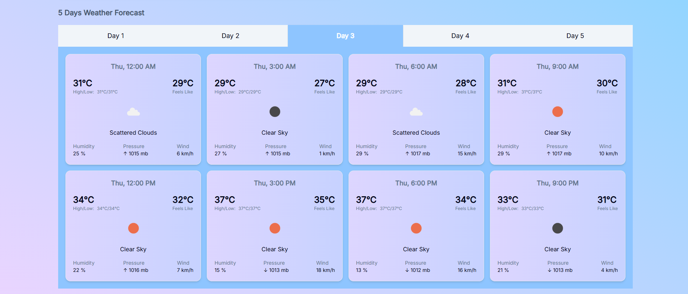
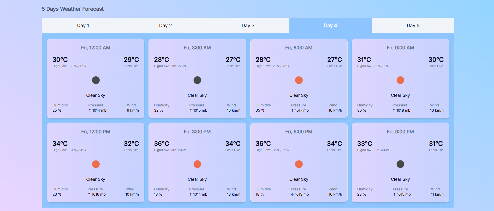
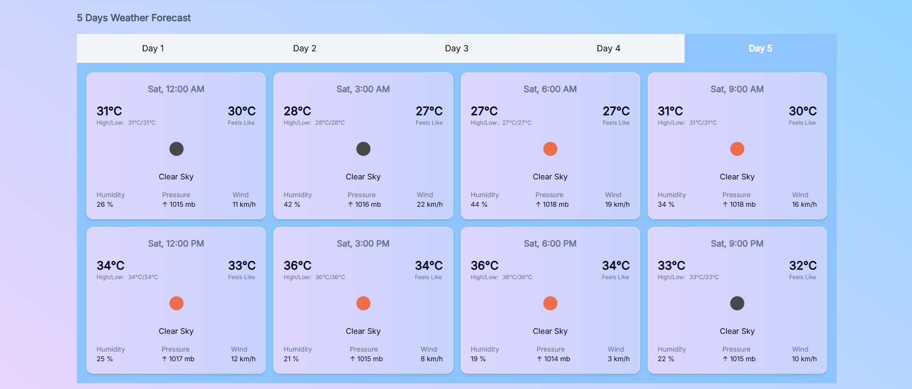

# Weathio 🌤️

Weathio is a responsive and modern weather web application built using **React.js**, **Tailwind CSS**, and **OpenWeatherMap APIs**. It provides real-time current weather data and a 5-day forecast (in 3-hour intervals) for any city worldwide.

This application is designed to demonstrate advanced frontend development skills including dynamic data fetching, UI responsiveness, **API integration**, state management, and modular component architecture. It also utilizes **Leaflet.js** for future support of geolocation-based features and **shadcn/ui** for elegant UI components.

---

## 🚀 Demo

You can check out the live version here: [Weathio](https://weathio.vercel.app/)

---

## 🌟 Features

- 🌍 Default city weather shown on initial load
- 🔍 Search any city worldwide to get weather updates
- 📊 Real-time **current weather details**:
  - Min/Max temperature
  - Feels like temperature
  - Weather icon (dynamic)
  - Sunrise and Sunset time
  - Humidity
  - Atmospheric pressure
  - Wind speed
  - Visibility
- 📅 5-day weather forecast:
  - Weather details for every 3-hour interval
  - Consistent UI formatting for easy comparison
- ⚡ Clean and responsive UI design using Tailwind CSS
- 🧩 Modular and reusable components

---

## 🔧 Tech Stack

| Technology     | Purpose                              |
| -------------- | ------------------------------------ |
| React.js       | Frontend UI and component logic      |
| JavaScript     | Application logic and API handling   |
| HTML           | Semantic structure and layout        |
| Tailwind CSS   | Utility-first responsive styling     |
| shadcn/ui      | Pre-built styled components          |
| OpenWeatherMap | Weather and forecast API             |
| Leaflet.js     | Map support for geolocation features |

---

## 🧩 Getting Started

### 1. Clone the Repository

git clone `https://github.com/sk-shahnawazkhan/weathio.git`  
cd weathio

### 2. Install Dependencies

✓ npm install  
✓ npm install tailwindcss @tailwindcss/vite  
✓ npm install @fontsource/inter  
✓ npm install react-leaflet@next  
✓ npx shadcn@latest init

> 💡**Note:** You need to install dependencies before runing the app.  
> In case of any issues, refer to the official documentation.

### 3. Add Your API Key

Create a .env/.env.local file in the root directory and add your OpenWeatherMap API key. Don't forget to add it to .gitignore file.  
VITE_API_KEY=your_api_key(Local/Development environment)  
API_KEY=your_api_key(Add it to Vercel/Netlify environment variables)

### 4. Start the application

Use `npm run dev` to start the application.

---

## 📸 Screenshots

  
  
  
  
  
  

---

## 🧠 Project Highlights

- Used React.js for building real-world application

- Efficient use of API integration with loading and error states

- Designing scalable and clean UI with Tailwind CSS

- Implementing modern UI/UX design practices

- Writing modular, maintainable, and readable frontend code

---

## 📦 Future Enhancements

- 🗺️ Display weather based on current user location

- 🌫️ Air pollution and AQI data integration

- 📈 Data visualization with charts (e.g., temperature trends)

---

## 👨‍💻 Author

Developed by [Shahnawaz Khan](https://shahnawazkhan.vercel.app/)  
Frontend Developer | React Developer  
[Portfolio](https://shahnawazkhan.vercel.app/) • [Linkedin](https://www.linkedin.com/in/sk-shahnawazkhan) • [Github](https://github.com/sk-shahnawazkhan)
